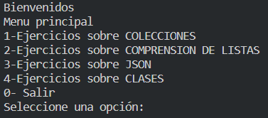
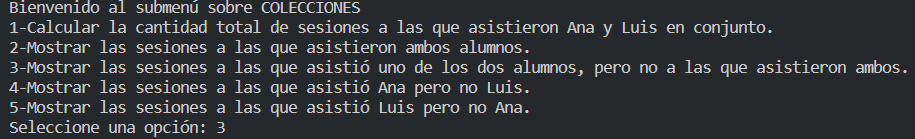

# MiddlePython - EOI Desarrollo Cloud

## ¿Quienes colaboran en este repositorio?

- Daniel Romero
- Alejandro Collantes
- Lautaro Rocca
- Álvaro Mateos

## ¿Cuáles son las configuraciones locales requeridas?

1. **Clonar el repositorio**

```
https://github.com/DanielRomero29/MiddlePython.git
```

2. **Comprobar que la versión de Python instalada coincida con la del proyecto:**

Este proyecto usa la versión **Python 3.11.0**.

3. **Crear y activar el entorno virtual**

Desde Visual Studio Code, presionamos Ctrl+S+P para abrir la paleta, donde escribimos ```Python: Create Environment``` para crear un entorno virtual ".venv" con la versión **3.11.0**

4. **Instalar las librerias**

Ejecutar el comando ```pip install -r requirements.txt```

5. **Ejecución del programa**

Ejecutar el comando ```py main.py```

## ¿Qué contiene este repositorio?

Este repositorio contiene unas carpetas, en las cuales podemos encontrar ejercicios o programas que se utilizan para trabajar con JSON, clases y distintas colecciones de Python.
Dentro del main encontraremos un menú con 4 opciones que corresponde a las 4 carpetas. Dentro de cada opción, un submenú con los ejercicios.



